University: ITMO University
Faculty: FICT
Course: Введение в веб технологии
Year: 2025/2026
Group: U4125
Author: Ganin Mikhail Alexandrovich
Lab: Coursework
Date of create: 17.03.2026
Date of finished: 17.03.2026

1. Установил все необходимые зависимости 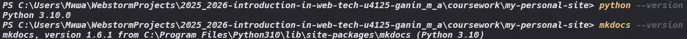
2. Настроил mkdocs.yml 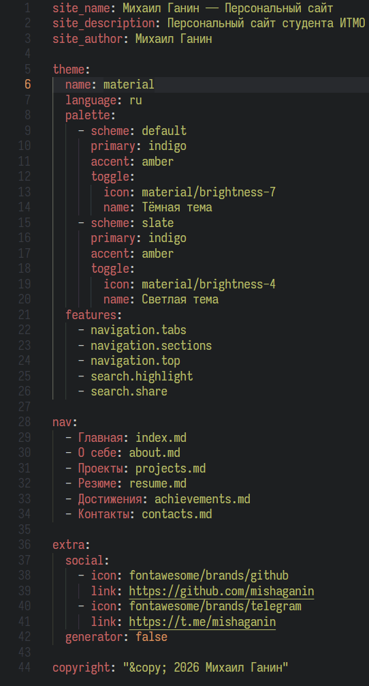
3. Создал markdown-файлы для страниц
4. Запустил сервер для проверки сайта, затем сбилдил его и задеплоил на github pages 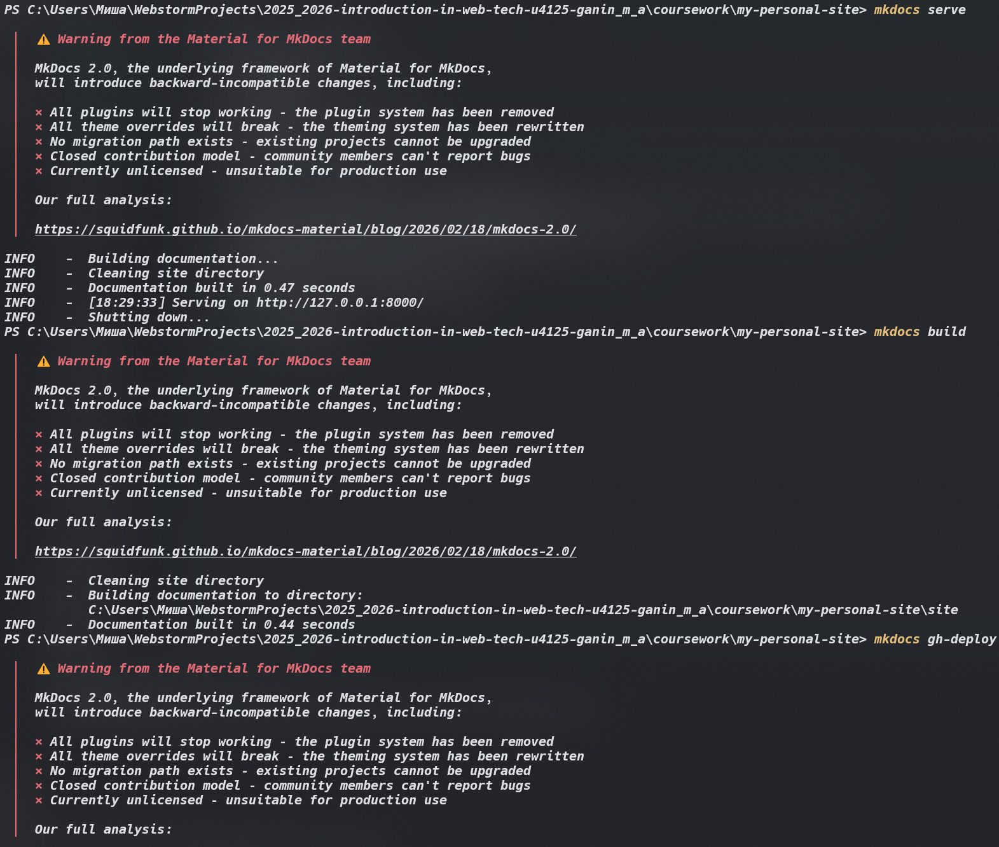
5. Итоговый сайт: https://mishaganin.github.io/2025_2026-introduction-in-web-tech-u4125-ganin_m_a/
6. Страницы: 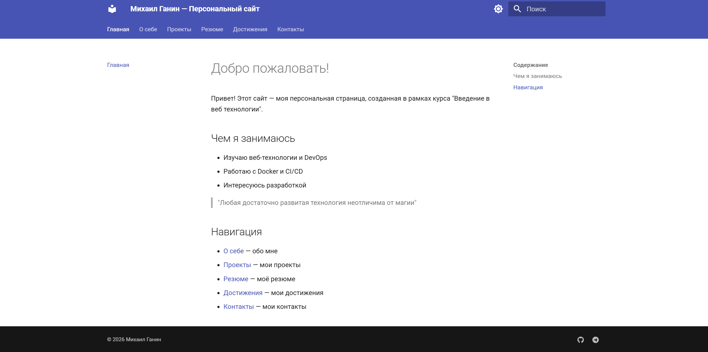 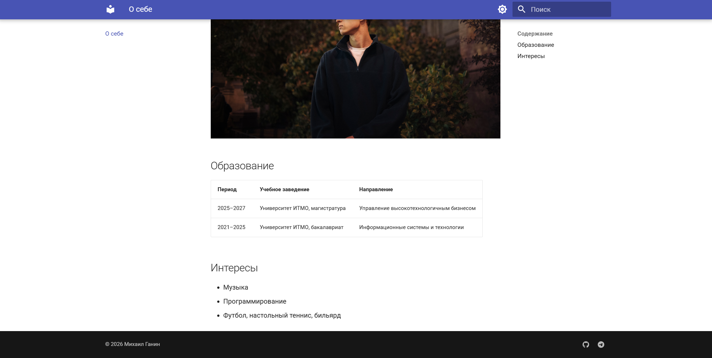 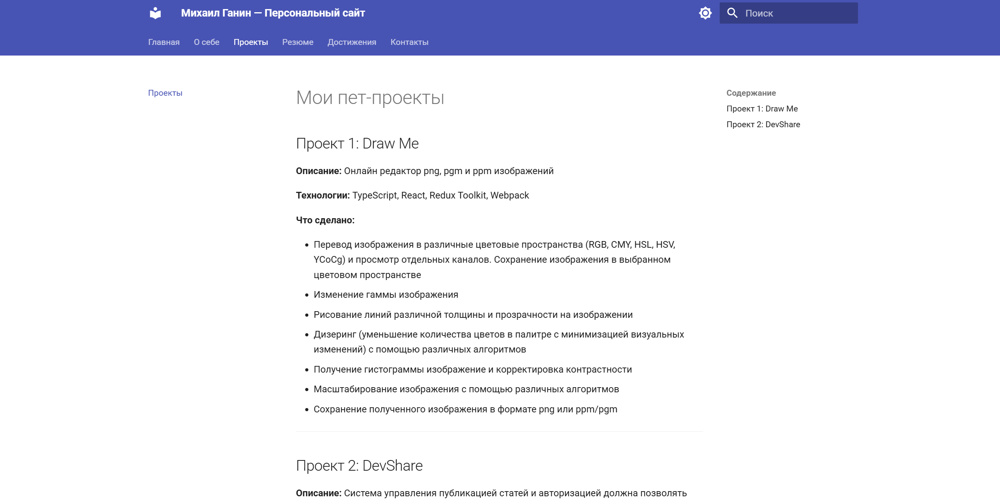 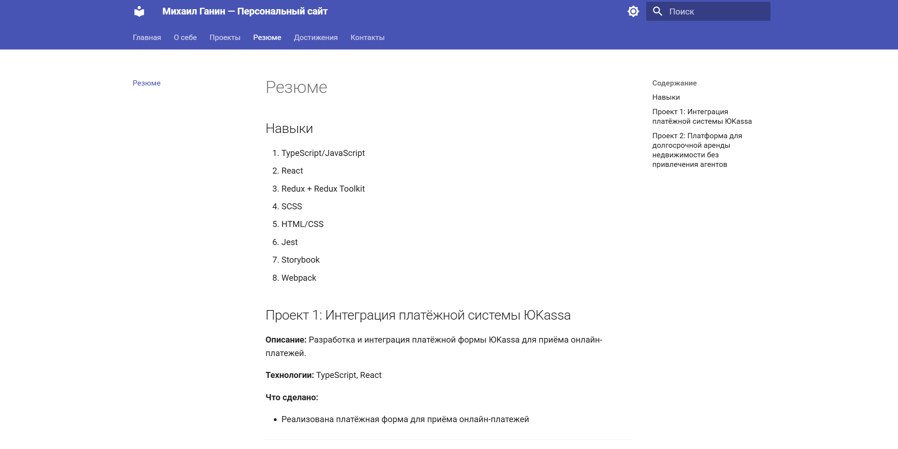 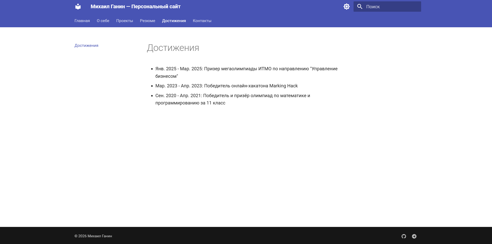 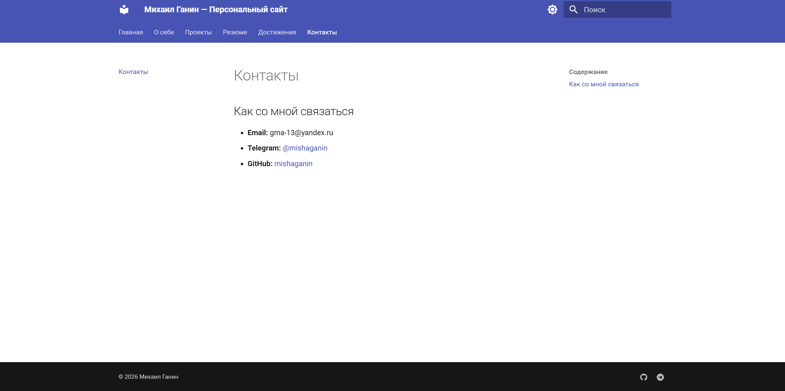
7. Рабочий поиск по словам 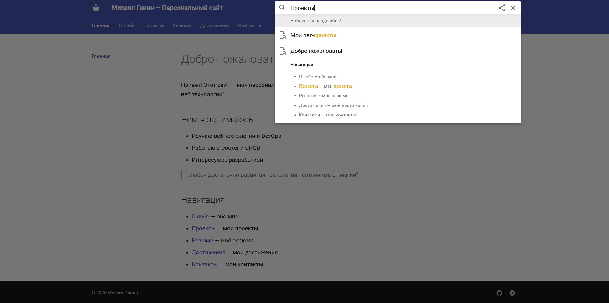
8. Футер с уникальными лого и ссылками 
9. Переключение на темную тему и обратно 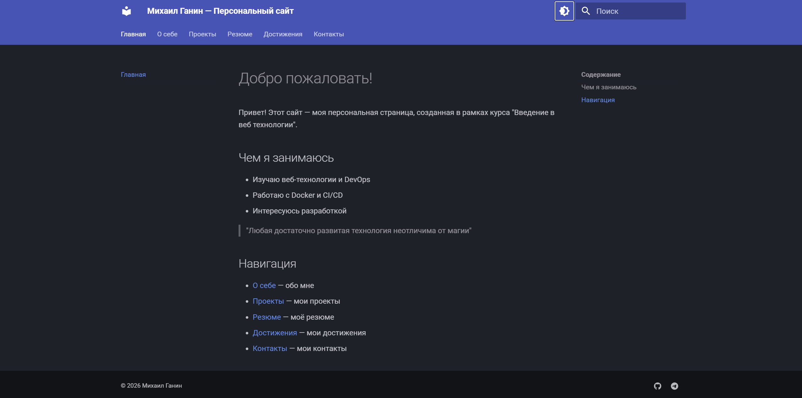
10. В папке site лежат файлы, которые сгенерировались после успешного билда 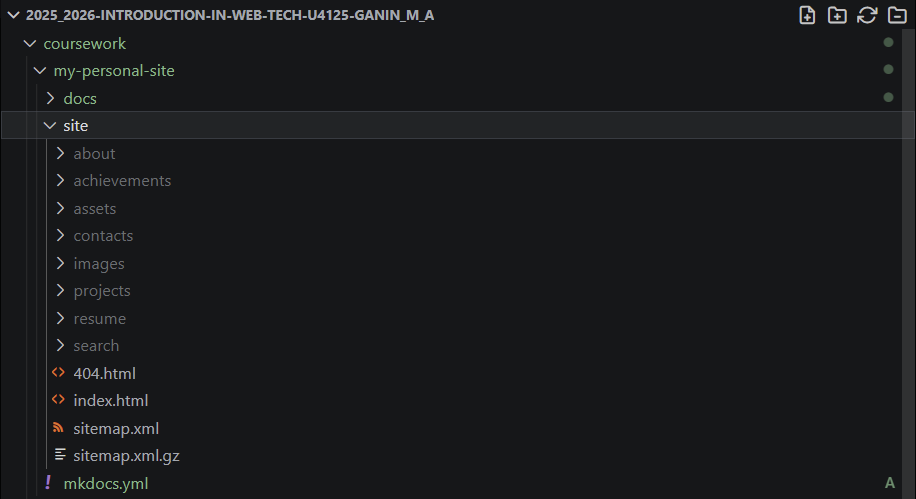