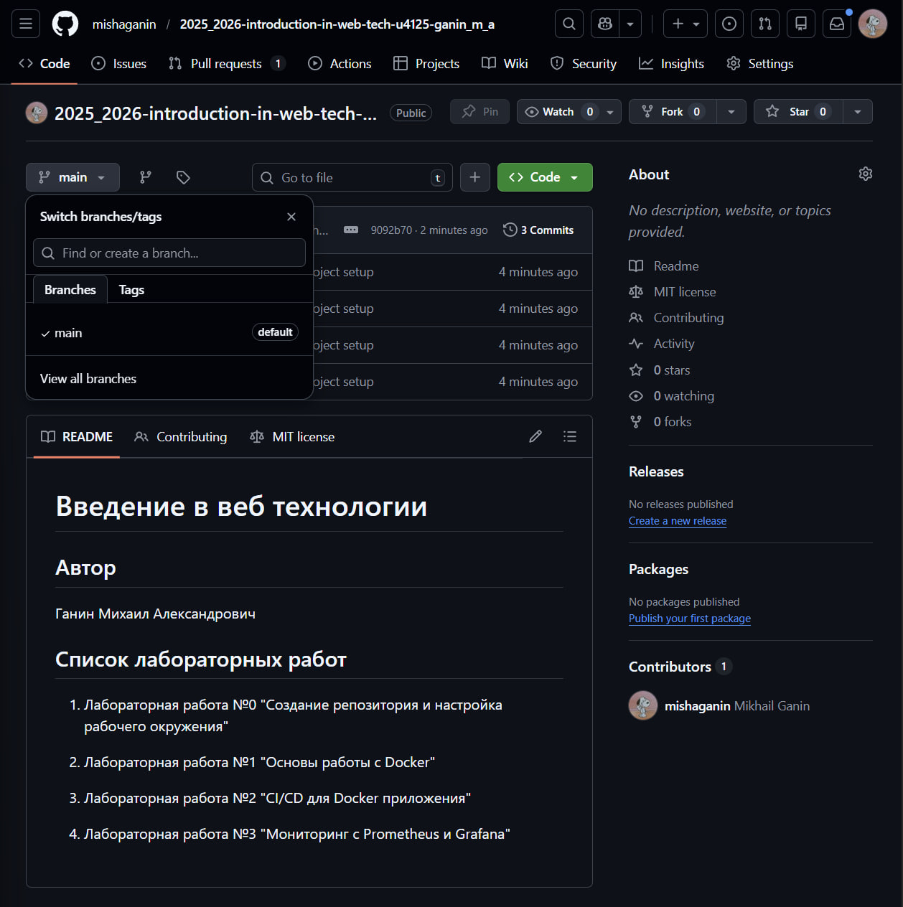
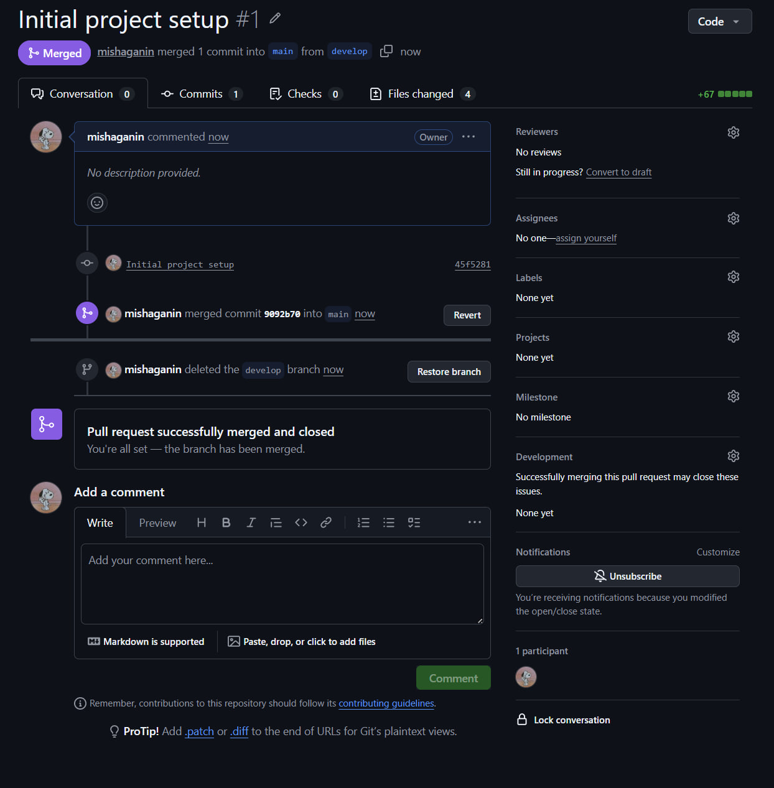

University: ITMO University
Faculty: FICT
Course: Введение в веб технологии
Year: 2025/2026
Group: U4125
Author: Ganin Mikhail Alexandrovich
Lab: Lab0
Date of create: 16.03.2026
Date of finished: 16.03.2026

1. Аккаунт на GitHub уже был, настроил новый SSH ключ
2. Создал новый репозиторий: https://github.com/mishaganin/2025_2026-introduction-in-web-tech-u4125-ganin_m_a
3. Склонировал репозиторий к себе на компьютер, работаю через vs code
4. Создал файлы README.md и .gitignore и заполнил их
6. Создал ветку develop, в ней создал файл CONTRIBUTING.md и заполнил его
8. Сделал коммит в ветке develop
9. Запушил коммит на удаленный репозиторий
10. Померджил PR, потом удалил ветку develop

