1. Проверил версию docker --version  
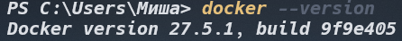
2. Запустил тестовый контейнер: docker run hello-world 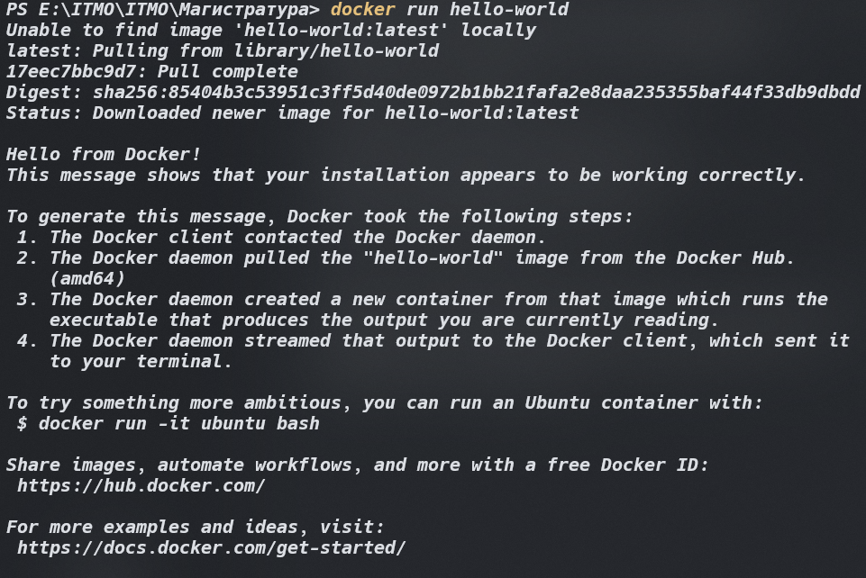
3. Запустил базовые команды: docker images, docker ps, docker ps -a 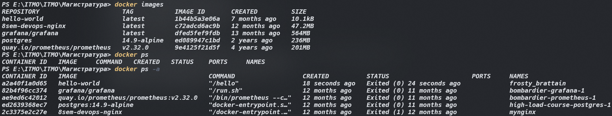
4. Скачал образ Ubuntu: docker pull ubuntu:latest 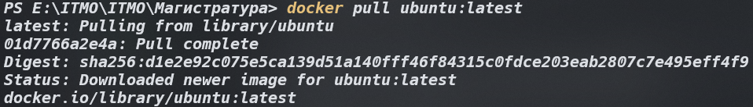
5. Запустил интерактивный контейнер: docker run -it ubuntu bash и внутри контейнера установил пакет (curl): apt update && apt install -y curl 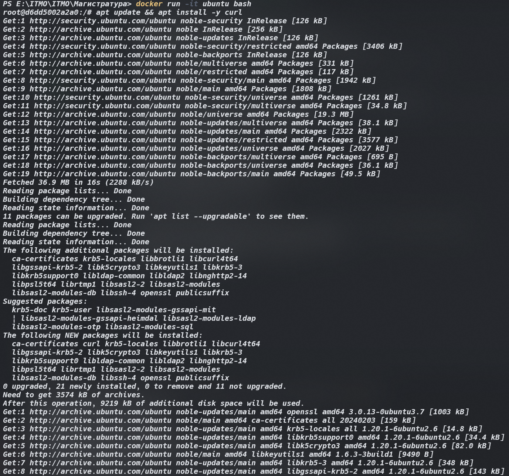
7. Проверил установку: curl --version 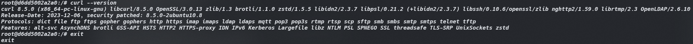
8. Запустить контейнер с nginx: docker run -d -p 8080:80 --name web-server nginx:alpine 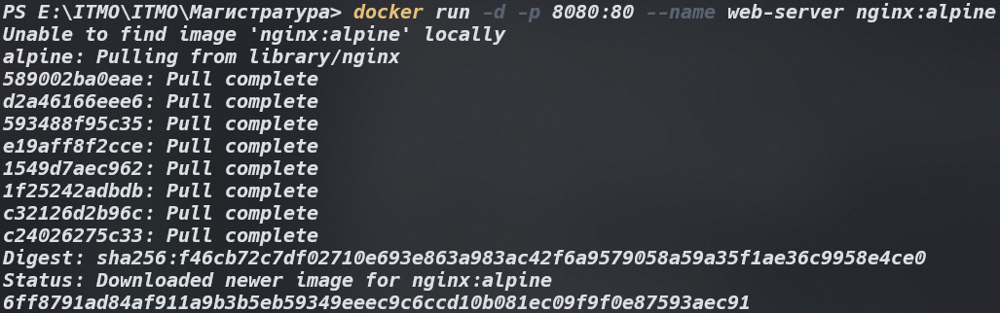
9. Проверил работу в браузере: http://localhost:8080 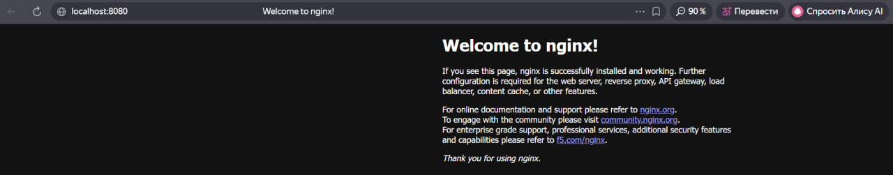
10. Посмотреть логи контейнера: docker logs web-server 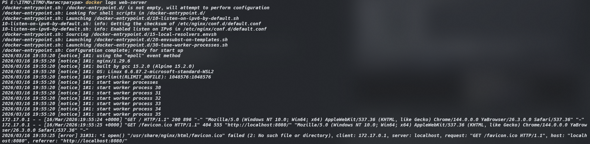
11. Посмотреть запущенные контейнеры и все контейнеры: docker ps и docker ps -a 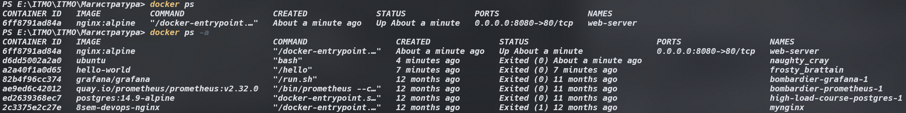
12. Остановил контейнер, а затем запустил его: docker stop web-server и docker start web-server 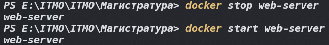
13. Удалил контейнер и образ: docker rm web-server и docker rmi nginx:alpine 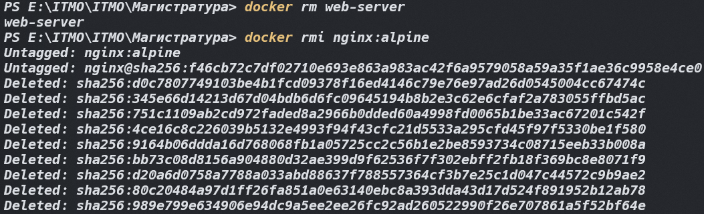
14. Создал том, а затем запустил контейнер с томом: docker volume create my-volume и docker run -it --name volume-test -d -v my-volume:/data ubuntu bash 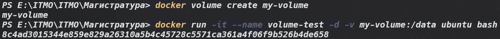
15. Подключился к контейнеру и создал файл в томе: docker exec -it volume-test bash и echo "Hello from volume" > /data/test.txt 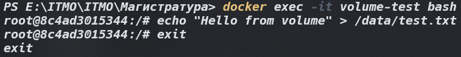
16. Удалить контейнер и создать новый с тем же томом 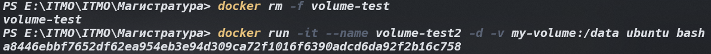
17. Проверить, что файл сохранился 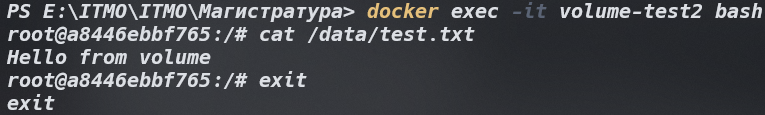