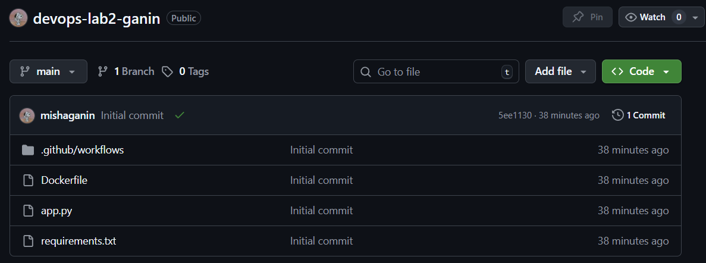
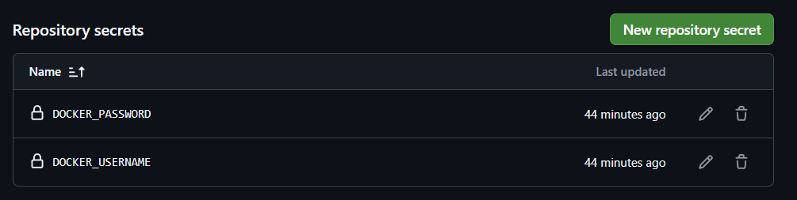
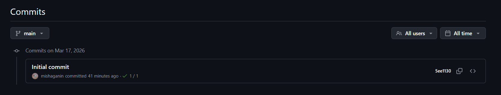
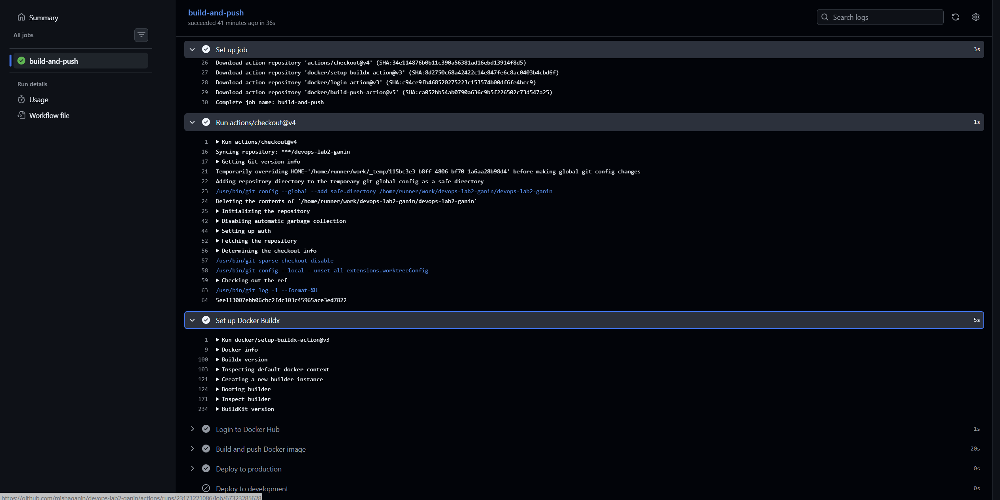
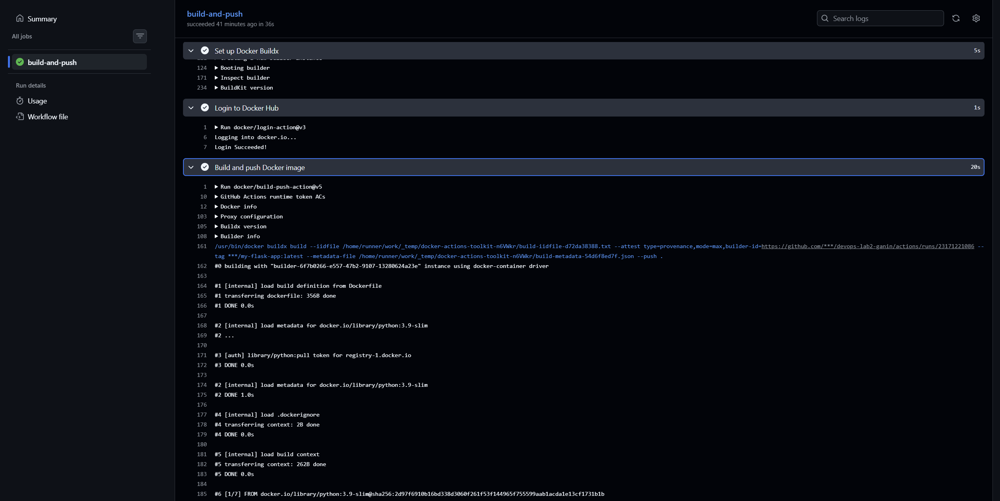
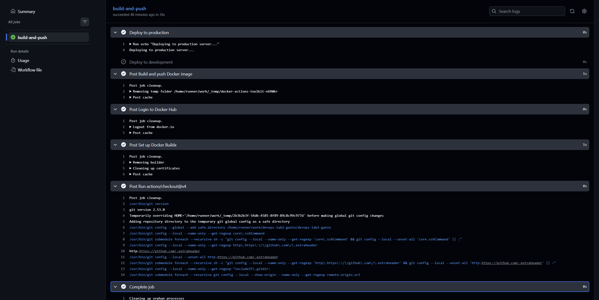
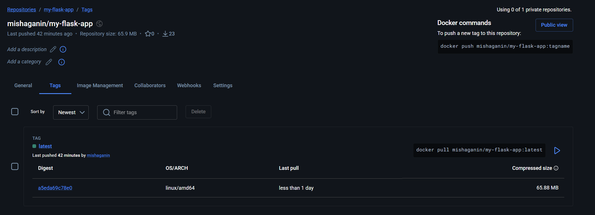

University: ITMO University
Faculty: FICT
Course: Введение в веб технологии
Year: 2025/2026
Group: U4125
Author: Ganin Mikhail Alexandrovich
Lab: Lab0
Date of create: 17.03.2026
Date of finished: 17.03.2026

1. Аккаунт на Docket Hub уже был создан
2. Все файлы добавил в другом github-репозитории: https://github.com/mishaganin/devops-lab2-ganin 
3. Создал там .github/workflows/docker-build.yml
4. В настройках репозитория добавил секреты, которые используются в docker-build.yml 
5. Сделал коммит и пуш в main, и там выполняется пайплайн в Actions 
7. Логи пайплайна на github-е   
8. Образ на Docker Hub 