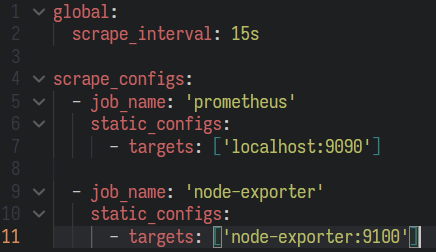
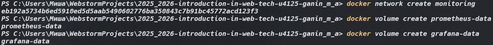
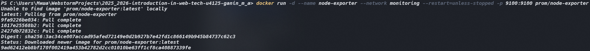
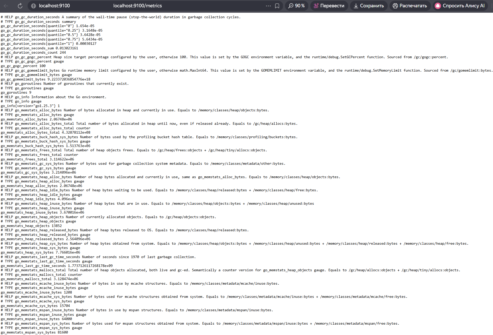
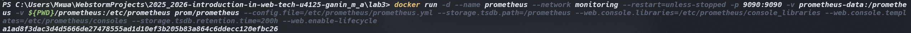
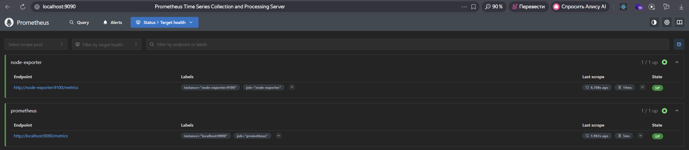
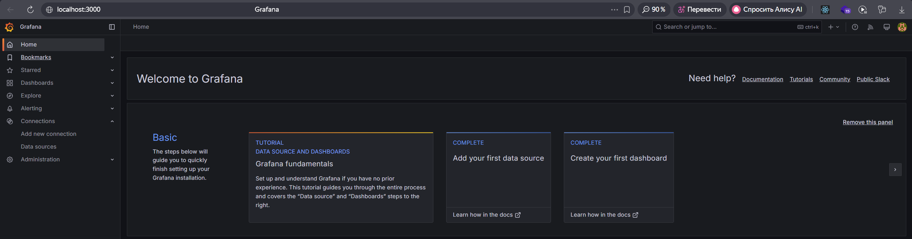
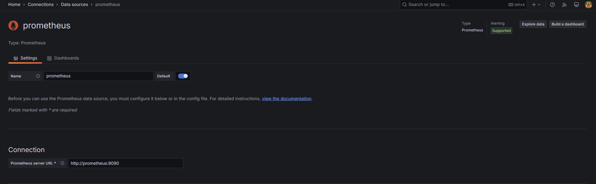
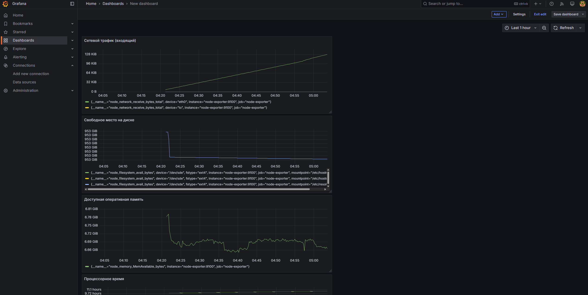
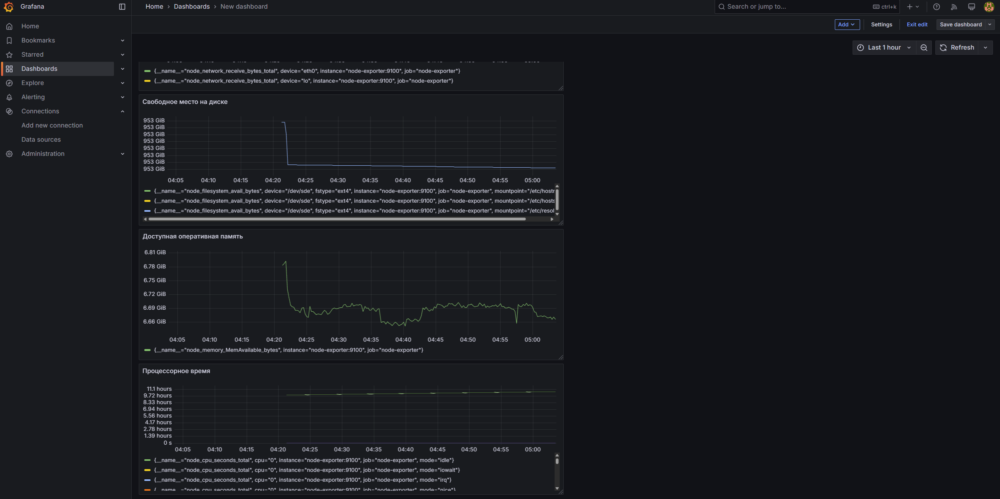

University: ITMO University
Faculty: FICT
Course: Введение в веб технологии
Year: 2025/2026
Group: U4125
Author: Ganin Mikhail Alexandrovich
Lab: Lab0
Date of create: 17.03.2026
Date of finished: 17.03.2026

1. Создал конфиг ./prometheus/prometheus.yml 
2. Затем создал сети и томы 
3. Запустил Node Exporter  
4. Запустил Prometheus  
5. Запустил Grafana 
6. Настроил Grafana 
7. Создал дэшборды  